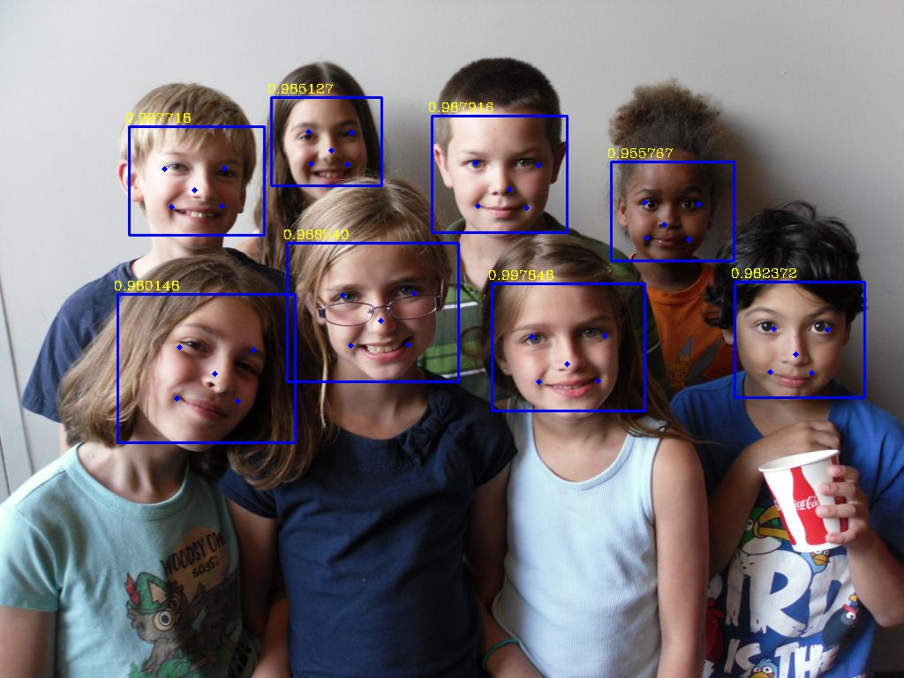

## ONNX->MNN

### 编译MNN

1. 安装Homebrew

   ```shell
   # macOS10.15.7
   /bin/zsh -c "$(curl -fsSL https://gitee.com/cunkai/HomebrewCN/raw/master/Homebrew.sh)"
   ```

2. 编译MNN  

   [官方编译](https://www.yuque.com/mnn/cn/demo_project)

   ```shell
     cd <mnn-root-dir>   //进入mnn根路径
     # 生成 schema ，可选
     cd schema && ./generate.sh
   
     # 进行编译
     cd <mnn-root-dir>
     mkdir build && cd build
     # 打开 编译DEMO、编译模型转换器
     cmake -DMNN_BUILD_DEMO=ON  -MNN_BUILD_CONVERTER=ON   ..
     make -j8
   ```

### 转化

1. 转为mnn

   [官方转化](https://www.yuque.com/mnn/cn/model_convert)

   ```shell
   cd <mnn-root-dir>/build/
   # 生成retinaface.mnn
   ./MNNConvert -f ONNX --modelFile faceDetector_sim.onnx --MNNModel retinaface.mnn --bizCode biz
   ```

### C++推理

1. 验证输出

（1）下载[RetinaFace_MNN](https://github.com/ItchyHiker/RetinaFace_MNN)推理项目

（2）修改代码

- `CMakeLists.txt` 

```cmake
# OpenCV路径：默认安装/usr/local/Cellar/opencv
# MNN路径： <mnn-root-dir>更改为本地mnn根路径
set(OpenCV_DIR /usr/local/Cellar/opencv/4.5.2/lib)
set(OpenCV_INCLUDE_DIRS /usr/local/Cellar/opencv/4.5.2/include/opencv4/)
set(MNN_DIR <mnn-root-dir>/build/libMNN.dylib)
set(MNN_INCLUDE_DIRS <mnn-root-dir>/include)
```

- `main.cpp`  更改第12、13行 模型、测试图片路径
- `retinaface.cpp`第26~29行key分别更改为“input0”、“prob”、"bbox"、"landmark"，与转化前key值对应。 

（3）可选项

- anchor比例：`retinaface.cpp`第128、130、132行
- 图像尺寸：`main.cpp`第15行

2. 构建项目

```shell
cd <RetinaFace_MNN-root-dir> #进入推理项目根路径
mkdir -p build
cd build
cmake .. #生成Makefile文件
make  -j4#根据Makefile文件进行编译
# 生成可执行文件RetinaFace
# 验证
./RetinaFace
```



**参考**

[MNN](https://github.com/alibaba/MNN)

[MNN文档](https://www.yuque.com/mnn/cn/cmake_opts)

