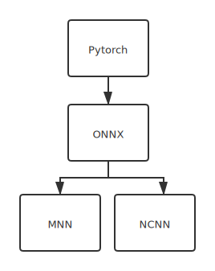

# 移动端部署

以[人脸检测库RetinaFace](https://github.com/biubug6/Face-Detector-1MB-with-landmark)为例，移动端推理框架NCNN、MNN较为常用。

### 示例

- [Pytorch->ONNX](Pytorch->ONNX.md)

- [ONNX->NCNN](ONNX->NCNN.md)

- [ONNX->MNN](ONNX->MNN.md)

### 流程

