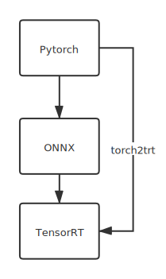

# 服务端部署

TensorRT仅适用`Nvidia GPU`

## 模型转化

|       | 优点   | 缺点         |
| ----- | ------ | ------------ |
| 方案1 | 最简单 | 支持算子较少 |
| 方案2 | 最通用 | 较复杂       |

### 方案1

- 环境： (1)部署TensorRT  (2)安装torch2trt

- `torch2trt.py`   通过torch2trt库，Pytorch直接转为TensorRT。

> 经测试，推理加速一倍左右，效果因模型而异。

### 方案2

- 环境： (1)部署TensorRT  (2)安装onnx、pycuda

- `torch2onnx2trt.py`   Pytorch->ONNX->TensorRT

## 流程

## 参考

[TensorRT部署](http://zengzeyu.com/2020/07/09/tensorrt_01_installation/)

[TensorRT部署常见错误](https://blog.csdn.net/QFJIZHI/article/details/107335865)

[TensorRT加速Pytorch](https://blog.csdn.net/leviopku/article/details/112963733)

[torch2trt](https://github.com/NVIDIA-AI-IOT/torch2trt)

