# TensorRT最佳实践

# 示例
- TensorRT API
  - [最简示例](./lenet.py)  
  - 访问[TensorRTx](https://github.com/wang-xinyu/tensorrtx)了解更多

- 解析ONNX 
  - [固定尺度](./main.py)  
  - 动态维度: 待更新 
  
 
# 整体流程
## 1.构建引擎

## 2.推理

## 三方库
- [torch2trt](https://github.com/NVIDIA-AI-IOT/torch2trt)
- [TRTorch](https://github.com/NVIDIA/TRTorch)
> Torch直接转为TRT，但支持算子少，不通用。

## 参考

- [TensorRT部署](http://zengzeyu.com/2020/07/09/tensorrt_01_installation/)
- [TensorRT部署常见错误](https://blog.csdn.net/QFJIZHI/article/details/107335865)
- [TensorRT加速Pytorch](https://blog.csdn.net/leviopku/article/details/112963733)
- [TensorRTx](https://github.com/wang-xinyu/tensorrtx)
- [TensorRT：深度学习推理加速](https://www.nvidia.cn/content/dam/en-zz/zh_cn/assets/webinars/oct16/Gary_TensorRT_GTCChina2019.pdf)